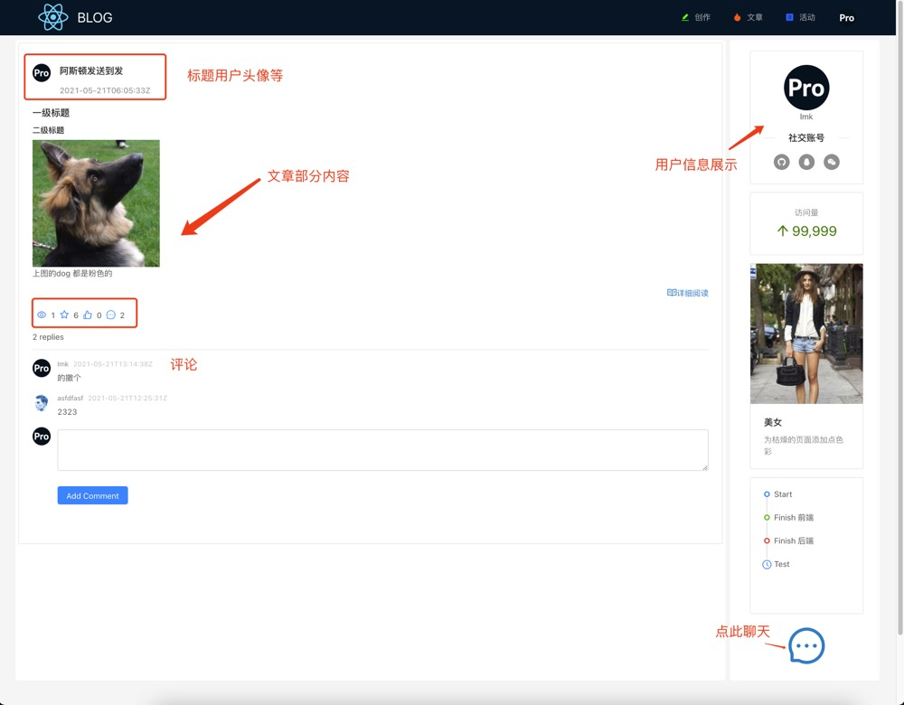
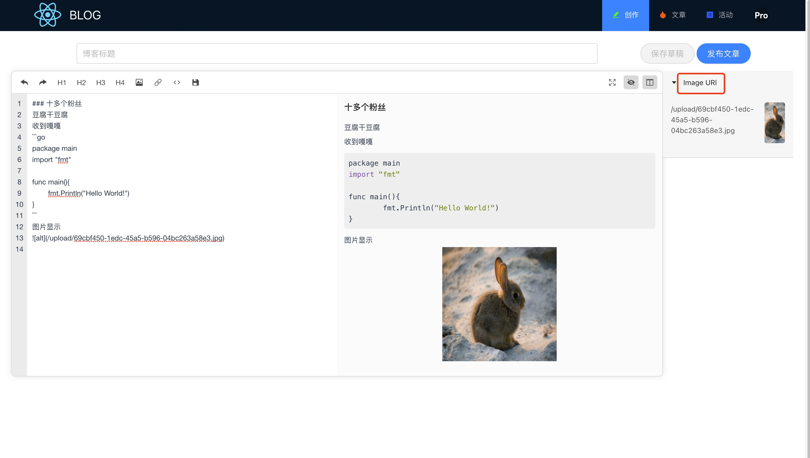
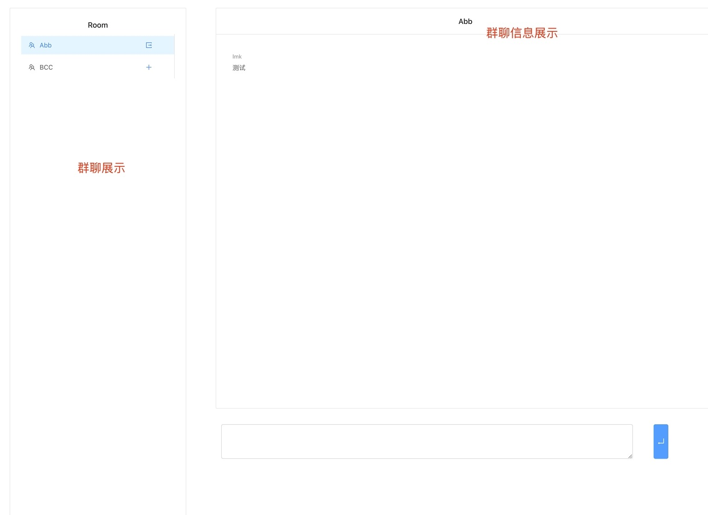

# go-blog

### 使用到的编程语言等:
前端：react+antd  
后端：golang+gin
数据库：mysql  
其他：redis、rabbitmq

### 功能：
- [x] 登录、注册等
- [x] 文章阅读，详细阅读等
- [x] 文章点赞，收藏，统计阅读次数
- [x] 文章markdown形式创作，支持上传图片
- [x] 同时多人多群在线聊天
- [x] 活动的抢票
### 描述：
起因：  
1.  阅读过许多大佬的文章，对许多技术有些许的了解，把之前的知识衔接起来
2.  想找一个工作后记录心得的地方
3.  go-blog与其说做一个博客，更不如说是一个论坛（可活动抢票、可聊天）  
### 使用：
待写

### 页面：
  
写作：  
  
聊天：  

### 意义：
对我自己而言：将知识进行了衔接，同时对一些基础的技术架构有初步的理解  
对新手而言：为新手提供一个学习的模版  
对大佬而言：啥也不是！～～

### 不足
1.  代码中存在有一些不规范的使用，可能会给读者带来一些阅读上的困难
2.  一些逻辑处理上可能会存在不恰当的地方
2.  前端页面缺少美观性

### 最后
如果你觉得对你有帮助的话，不妨点个star哈～